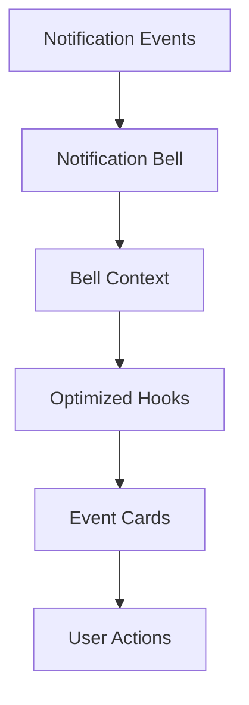

# System Notifications

The System Notifications feature provides a comprehensive notification management system with real-time updates, categorized alerts, and intelligent notification handling.

## Overview

Introduced in v6.4.0, the notification system delivers a modern notification experience with:

- **Bell Dropdown**: Centralized notification hub with per-type counts
- **Event Cards**: Rich notification content with actions
- **Smart Filtering**: Category-based notification organization
- **Permission-Aware**: Role-based notification access

## Architecture

### Component Structure

```
src/components/features/notifications/
├── notification-bell.tsx           # Bell dropdown component
├── notification-event-card.tsx     # Individual notification cards
├── notification-event-card.utils.ts # Card utilities and helpers
├── notification-filters.tsx         # Category filtering
├── notification-preferences.tsx    # User notification settings
└── index.ts                        # Public exports
```

### Data Flow



## Key Features

### 🔔 Notification Bell

**Location**: `src/components/features/notifications/notification-bell.tsx`

#### Features
- **Per-Type Counts**: Unread count for each notification category
- **Permission-Based Access**: Different notifications for different roles
- **Smart Routing**: Context-aware navigation to relevant pages
- **Error Resilience**: Graceful fallback on hook failures

#### Implementation
```typescript
export const NotificationBell: React.FC<NotificationBellProps> = ({ 
  buttonStyle, 
  badgeOffset 
}) => {
  const { user, userDataLoaded } = useD1Auth();
  const { unreadCount } = useNotificationsOptimized();
  const { data: bellContext } = useNotificationBellContext();
  const { canRead } = usePermissions();
  
  // Permission-aware routing
  const canViewNotifications = canRead('notifications');
  const canViewSystemNotifications = canRead('notification_events');
};
```

### 📋 Event Cards

**Location**: `src/components/features/notifications/notification-event-card.tsx`

#### Features
- **Rich Content**: Detailed notification information
- **Action Buttons**: Direct actions from notifications
- **Status Indicators**: Visual state representation
- **Responsive Design**: Mobile-optimized layout

#### Card Types
1. **System Alerts**: Critical system notifications
2. **User Actions**: User-triggered events
3. **Library Updates**: Catalog and policy changes
4. **Deadlines**: Due dates and reminders

### 🎯 Smart Filtering

**Location**: `src/components/features/notifications/notification-filters.tsx`

#### Filter Categories
- **All Notifications**: Complete notification history
- **Unread Only**: Filter for unread items
- **By Type**: Category-specific filtering
- **By Date**: Time-based filtering

### ⚙️ Notification Preferences

**Location**: `src/components/features/notifications/notification-preferences.tsx`

#### User Controls
- **Email Notifications**: Toggle email delivery
- **Push Notifications**: Browser notification settings
- **Category Preferences**: Per-category notification controls
- **Frequency Settings**: Digest vs immediate notifications

## Technical Implementation

### Hooks and Context

#### useNotificationsOptimized
```typescript
// Optimized notification hook with caching
const {
  data: notifications,
  unreadCount,
  loading,
  error,
  refetch
} = useNotificationsOptimized();
```

#### useNotificationBellContext
```typescript
// Bell-specific context for dropdown state
const {
  data: bellContext,
  isLoading: bellContextLoading
} = useNotificationBellContext();
```

### Permission Integration

The notification system integrates tightly with the permission system:

```typescript
const { canRead } = usePermissions();
const canViewNotifications = canRead('notifications');
const canViewSystemNotifications = canRead('notification_events');

// Role-based notification routing
const notificationsPath = `${dashboardBasePath}/notifications`;
const announcementsPath = canViewSystemNotifications 
  ? `${dashboardBasePath}/announcements` 
  : '/announcements';
```

### Performance Optimizations

#### Caching Strategy
- **React Query**: Intelligent caching with background refetch
- **Optimistic Updates**: Instant UI feedback
- **Pagination**: Efficient loading of large notification lists

#### Error Handling
- **Graceful Degradation**: Fallback UI on hook failures
- **Retry Logic**: Automatic retry for failed requests
- **Error Boundaries**: Isolated error handling

## User Experience

### Responsive Design

#### Mobile Experience
- **Touch-Friendly**: Optimized tap targets
- **Swipe Actions**: Gesture-based interactions
- **Compact View**: Space-efficient mobile layout

#### Desktop Experience
- **Hover States**: Rich interaction feedback
- **Keyboard Navigation**: Full keyboard accessibility
- **Multi-Window**: Synchronized state across tabs

### Accessibility

#### WCAG 2.1 AA Compliance
- **Screen Reader Support**: Comprehensive ARIA labels
- **Keyboard Navigation**: Tab order and shortcuts
- **Color Contrast**: High contrast visibility
- **Focus Management**: Logical focus flow

#### Internationalization
- **Multi-Language**: Support for multiple languages
- **RTL Support**: Right-to-left language support
- **Time Zones**: Localized timestamp display

## Security Considerations

### Data Privacy

#### Permission Enforcement
- **Role-Based Access**: Users see only authorized notifications
- **Data Isolation**: Strict separation of user data
- **Audit Trail**: Complete notification access logging

#### Content Security
- **XSS Prevention**: Sanitized notification content
- **CSRF Protection**: Secure notification actions
- **Input Validation**: Strict data validation

### Rate Limiting

#### API Protection
- **Request Throttling**: Prevent notification spam
- **Bulk Operations**: Efficient batch processing
- **Circuit Breaker**: Automatic failover on errors

## Configuration

### Environment Variables

```bash
# Notification settings
NOTIFICATION_POLL_INTERVAL=30000
NOTIFICATION_BATCH_SIZE=50
NOTIFICATION_MAX_AGE=86400000
```

### Feature Flags

```typescript
// Feature toggles for notification features
const NOTIFICATION_FEATURES = {
  EMAIL_NOTIFICATIONS: process.env.ENABLE_EMAIL_NOTIFICATIONS,
  PUSH_NOTIFICATIONS: process.env.ENABLE_PUSH_NOTIFICATIONS,
  BULK_OPERATIONS: process.env.ENABLE_BULK_NOTIFICATIONS,
};
```

## API Integration

### Endpoints

#### Notification Retrieval
```http
GET /api/notifications
GET /api/notifications/unread
GET /api/notifications/count
```

#### Notification Actions
```http
POST /api/notifications/{id}/read
POST /api/notifications/{id}/archive
POST /api/notifications/mark-all-read
```

#### Preferences
```http
GET /api/notifications/preferences
PUT /api/notifications/preferences
```

### Response Format

```typescript
interface NotificationResponse {
  id: string;
  type: 'system' | 'user' | 'library' | 'deadline';
  title: string;
  message: string;
  timestamp: string;
  read: boolean;
  actionUrl?: string;
  metadata: Record<string, unknown>;
}
```

## Performance Metrics

### Key Indicators

- **Load Time**: < 500ms for initial notification load
- **Update Latency**: < 200ms for real-time updates
- **Memory Usage**: < 10MB for notification state
- **Network Efficiency**: < 50KB per notification batch

### Monitoring

#### Performance Tracking
```typescript
// Performance monitoring
const performanceMetrics = {
  notificationLoadTime: measureTime(() => loadNotifications()),
  renderTime: measureRenderTime(NotificationBell),
  apiLatency: trackApiLatency('/api/notifications'),
};
```

## Testing

### Unit Tests

#### Hook Testing
```typescript
describe('useNotificationsOptimized', () => {
  it('should fetch notifications successfully');
  it('should handle API errors gracefully');
  it('should update unread count correctly');
});
```

#### Component Testing
```typescript
describe('NotificationBell', () => {
  it('should display correct unread count');
  it('should handle permission restrictions');
  it('should navigate to correct pages');
});
```

### Integration Tests

#### End-to-End Scenarios
- **Notification Flow**: Complete user journey
- **Permission Testing**: Role-based access validation
- **Performance Testing**: Load and stress testing

## Troubleshooting

### Common Issues

#### Hook Failures
```typescript
// Error handling in notification bell
try {
  const hookResult = useNotificationsOptimized();
  unreadCount = hookResult.unreadCount;
} catch (_hookError) {
  // Graceful fallback
  unreadCount = 0;
}
```

#### Permission Issues
- **Missing Permissions**: Check user role assignments
- **API Errors**: Verify backend notification endpoints
- **Context Issues**: Ensure proper provider setup

### Debug Mode

Enable debug logging:

```typescript
if (process.env.NODE_ENV === 'development') {
  console.log('Notification Debug:', {
    unreadCount,
    bellContext,
    permissions: { canViewNotifications, canViewSystemNotifications },
  });
}
```

## Future Enhancements

### Planned Features

#### v6.7.0 Roadmap
- **Real-Time WebSocket**: Live notification updates
- **Smart Filtering**: AI-powered notification categorization
- **Batch Actions**: Bulk read/archive operations
- **Notification Templates**: Customizable notification formats

#### Long-term Vision
- **Cross-Platform**: Mobile app notifications
- **Integration**: Third-party notification services
- **Analytics**: Notification engagement metrics
- **Automation**: Rule-based notification routing

## Related Documentation

- [Permission System](../permissions/overview.md)
- [User Dashboard](../features/enhanced-user-dashboard.md)
- [API Documentation](../../api/notifications.md)
- [Performance Guidelines](../../performance/optimization.md)

---

**Last Updated**: v6.6.2 (2026-03-14)  
**Maintainers**: SJRS LMS Development Team
