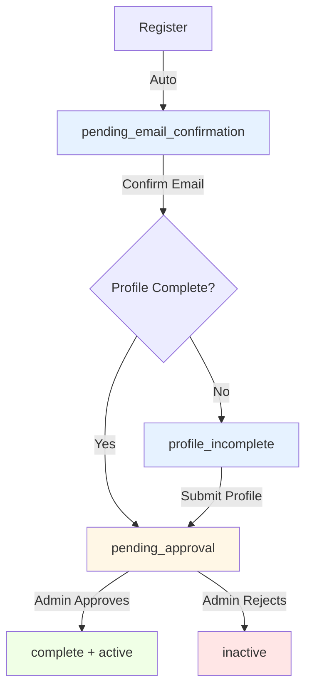

# 🔄 Onboarding Status System

The **onboarding status system** tracks users through their registration, verification, and activation workflow. This is separate from (but related to) the account `status` field.

## 📊 Status Fields Overview

SJRS LMS uses **two** status fields for user accounts:

| Field | Purpose | Managed By |
|-------|---------|------------|
| `status` | Account state (active, inactive, suspended, pending) | Database/User Status |
| `onboarding_status` | Registration workflow progress | Onboarding Workflow |

### Relationship

- **`status`** controls access permissions and account lifecycle
- **`onboarding_status`** tracks granular onboarding steps
- Both work together for the complete user experience

---

## 🎯 Onboarding Status Values

### `pending_email_confirmation`

**Description**: User registered but hasn't verified their email

**When Set**:
- Automatically on registration (`POST /api/auth/register`)
- Before email confirmation link is clicked

**User Experience**:
- Cannot log in
- Shown "Verify your email" message
- Receives email with confirmation link

**Database State**:
```typescript
{
  status: 'pending',
  onboarding_status: 'pending_email_confirmation',
  email_verified: false,
  profile_completed: false
}
```

**Admin Actions**:
- Can manually verify email
- Can resend confirmation email
- Can delete unverified accounts after timeout

**Color/Badge**: 🔵 Blue / Orange

---

### `profile_incomplete`

**Description**: Email verified, but user profile not completed

**When Set**:
- Automatically after email confirmation if profile fields are missing
- User hasn't submitted required profile information (for students: registration_number, year_of_study)

**User Experience**:
- Can log in
- Redirected to profile completion page
- Cannot access main dashboard features

**Database State**:
```typescript
{
  status: 'pending',
  onboarding_status: 'profile_incomplete',
  email_verified: true,
  profile_completed: false
}
```

**Required Profile Fields**:
- **Students**: `registration_number`, `year_of_study`
- **Professors**: `department`, `specialization`
- **Guests**: Basic contact info (may skip profile step)

**Admin Actions**:
- Can complete profile on behalf of user
- Can mark profile as complete manually

**Color/Badge**: 🔵 Blue

---

### `pending_approval`

**Description**: Profile complete, awaiting admin/superuser approval

**When Set**:
- Automatically after profile completion
- User submitted all required information but account not yet activated

**User Experience**:
- Can log in
- Sees "Pending Approval" status
- Limited access (dashboard visible but features locked)
- Can view orders/loans from profile but not create new ones

**Database State**:
```typescript
{
  status: 'pending',
  onboarding_status: 'pending_approval',
  email_verified: true,
  profile_completed: true
}
```

**Admin Actions**:
- Review user profile
- Approve → sets `status = 'active'`, `onboarding_status = 'complete'`
- Reject → sets `status = 'inactive'`
- Request more information → contact user

**Color/Badge**: 🟠 Orange

---

### `complete`

**Description**: Onboarding finished, account fully activated

**When Set**:
- Manually by admin/superuser on approval (`PUT /api/users/:id`)
- After setting `status = 'active'`

**User Experience**:
- Full system access
- All features unlocked
- Normal user experience

**Database State**:
```typescript
{
  status: 'active',
  onboarding_status: 'complete',
  email_verified: true,
  profile_completed: true
}
```

**Admin Actions**:
- Standard user management (suspend, change role, etc.)
- Can revert to pending if needed

**Color/Badge**: 🟢 Green

---

## 🔀 Status Transition Flow



---

## 🎨 Display Colors & Labels

### Frontend Constants

All status values are defined in [`src/constants/user-status.ts`](e:\GitHub\sjrslms\src\constants\user-status.ts):

```typescript
export const USER_STATUS = {
  PENDING_EMAIL_CONFIRMATION: 'pending_email_confirmation',
  PROFILE_INCOMPLETE: 'profile_incomplete',
  PENDING_APPROVAL: 'pending_approval',
  COMPLETE: 'complete',
  ACTIVE: 'active',
  INACTIVE: 'inactive',
  SUSPENDED: 'suspended',
} as const;

export const USER_STATUS_COLORS = {
  pending_email_confirmation: 'blue',
  profile_incomplete: 'blue',
  pending_approval: 'orange',
  complete: 'green',
  active: 'green',
  inactive: 'red',
  suspended: 'red',
} as const;

export const USER_STATUS_LABELS = {
  pending_email_confirmation: 'Pending Email Confirmation',
  profile_incomplete: 'Profile Incomplete',
  pending_approval: 'Pending Approval',
  complete: 'Complete',
  active: 'Active',
  inactive: 'Inactive',
  suspended: 'Suspended',
} as const;
```

### Utility Functions

**Get Display Color**:
```typescript
import { USER_STATUS_COLORS } from '@/constants/status';
const color = USER_STATUS_COLORS[status];
```

**Get Display Label**:
```typescript
import { USER_STATUS_LABELS } from '@/constants/status';
const label = USER_STATUS_LABELS[status];
```

---

## 🔧 Backend Implementation

### Database Schema

**Table**: `library_users`

| Column | Type | Description |
|--------|------|-------------|
| `status` | TEXT | Account status (active/inactive/suspended/pending) |
| `onboarding_status` | TEXT | Onboarding workflow status |
| `email_verified` | BOOLEAN | Email confirmation flag |
| `profile_completed` | BOOLEAN | Profile completion flag (derived) |

### Auto-Update Logic

**Email Confirmation** ([`functions/api/auth/email-confirmation.ts`](e:\GitHub\sjrslms\functions\api\auth\email-confirmation.ts)):
```typescript
// After email verification
await env.DB.prepare(
  `UPDATE library_users SET 
    email_verified = 1,
    onboarding_status = ?,
    updated_at = datetime('now') 
  WHERE id = ?`
).bind(
  profileCompleted ? 'pending_approval' : 'profile_incomplete',
  userId
).run();
```

**Profile Completion** ([`src/pages/profile-completion/hooks/useProfileSubmission.ts`](e:\GitHub\sjrslms\src\pages\profile-completion\hooks\useProfileSubmission.ts)):
```typescript
// After profile submission
updateUser({ 
  profile_completed: true,
  onboarding_status: 'pending_approval'
});
```

**Admin Approval** ([`functions/api/users/handlers/update-user.ts`](e:\GitHub\sjrslms\functions\api\users\handlers\update-user.ts)):
```typescript
// When admin activates account
if (status === 'active') {
  onboarding_status = 'complete';
}
```

---

## 📋 Admin User Management

### Viewing Onboarding Status

**Students Page** ([`/students`](http://localhost:5173/students)):
- "Onboarding Status" column in table
- Filter dropdown with all status values
- Color-coded status badges

**Professors Page** ([`/professors`](http://localhost:5173/professors)):
- Same display as students
- Filter by onboarding status

**Members Page** ([`/members`](http://localhost:5173/members)):
- Combined view of all user types
- Onboarding status column
- Filter support

### Editing Onboarding Status

**Edit Modal** (Students/Professors):
- "Onboarding Status" dropdown field
- Current status pre-filled
- Options:
  - Pending Email Confirmation
  - Profile Incomplete
  - Pending Approval
  - Complete

**Update Behavior**:
```typescript
PUT /api/users/:id
{
  "onboarding_status": "complete", // Manual override
  "status": "active"                // Activates account
}
```

---

## 🚨 Common Issues & Troubleshooting

### Issue: User stuck in `pending_approval`

**Symptoms**: Email verified, profile complete, but can't access features

**Fix**:
1. Admin navigates to Students/Professors page
2. Finds user in table
3. Clicks Edit
4. Sets:
   - Status: `active`
   - Onboarding Status: `complete`
5. Saves

### Issue: `onboarding_status` shows as `undefined`

**Cause**: Backend not returning field or old data

**Fix**:
1. Check API response includes `onboarding_status`
2. Verify database column exists and populated
3. Clear cache and refetch: `queryClient.invalidateQueries(['d1-students'])`

### Issue: User redirected to profile-completion despite complete profile

**Cause**: Auth context not updated or fallback logic too aggressive

**Fix**: ✅ **Fixed in latest version**
- Backend now checks record existence instead of field values
- Auth context updates immediately after profile submission
- Frontend respects `onboarding_status` from database

---

## 🎓 Best Practices

### For Admins

1. **Review pending users regularly** - Check "Pending Approval" filter daily
2. **Verify institutional eligibility** - Confirm registration numbers/departments
3. **Set proper roles** - Assign appropriate permissions on activation
4. **Communicate rejections** - Contact users if denying access

### For Developers

1. **Always use constants** - Import from `@/constants/status`
2. **Respect database authority** - `onboarding_status` field is canonical
3. **Handle all statuses** - Include all values in switch/case statements
4. **Test transitions** - Verify each status change updates UI correctly
5. **Audit log status changes** - Track who changed status and when

---

## 🔗 Related Documentation

- [Registration Flow Guide](/user-guides/registration-flow)
- [User Management](/features/users/)
- [Permission System](/features/permissions/)
- [Authentication Architecture](/security/)

---

## 📝 API Reference

### Check Onboarding Status (Public)

```http
POST /api/auth/check-status/send-otp
POST /api/auth/check-status/verify
```

### Update Onboarding Status (Admin)

```http
PUT /api/users/:id
Content-Type: application/json

{
  "onboarding_status": "complete",
  "status": "active"
}
```

### Get Current User (Authenticated)

```http
GET /api/auth/me
```

Returns `onboarding_status` and `workflowStatus` in response.

---

**Last Updated**: March 3, 2026  
**Version**: 1.0.0
