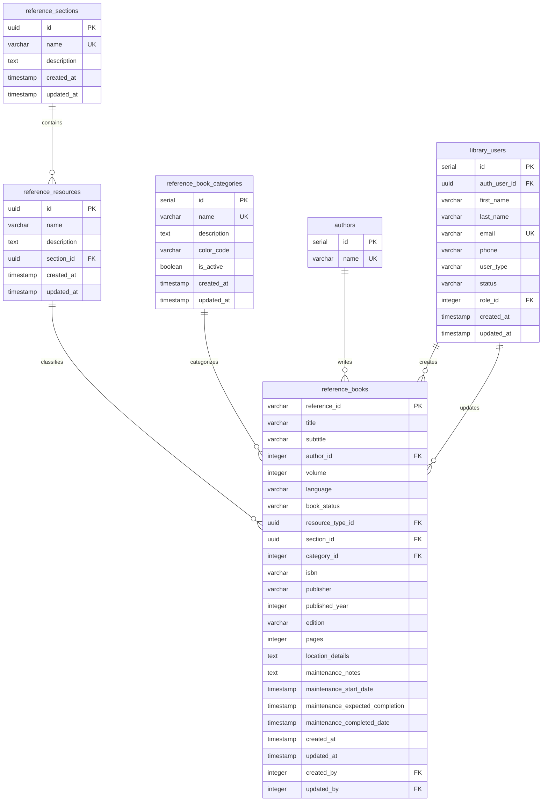
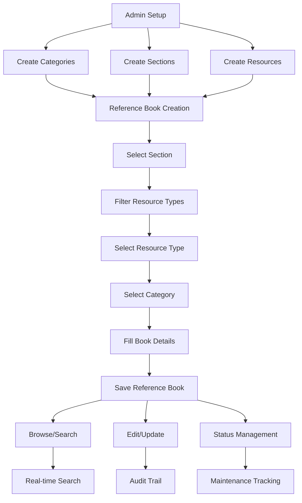

## Database Schema Overview



## Key Relationships

### 1. Hierarchical Classification
```
reference_sections (1) → (N) reference_resources
reference_resources (1) → (N) reference_books
reference_book_categories (1) → (N) reference_books
```

### 2. Audit Trail
```
library_users (1) → (N) reference_books (created_by)
library_users (1) → (N) reference_books (updated_by)
```

### 3. Content Attribution
```
authors (1) → (N) reference_books
```

## Data Flow Diagram



## Entity Relationship Details

### Reference Book Categories
- **Purpose**: Classify reference materials by type
- **Examples**: Dictionaries, Encyclopedias, Manuals, Directories
- **Optional**: Reference books don't require a category
- **Color Coding**: Visual distinction in UI

### Reference Sections
- **Purpose**: Organize by physical/departmental location
- **Examples**: Academic Section, Research Section, General Section
- **Required**: All reference books must have a section
- **UUID Primary Key**: Modern identifier system

### Reference Resources
- **Purpose**: Define resource types within sections
- **Examples**: Textbooks, Manuals, Guides, Handbooks
- **Section-dependent**: Filtered by selected section
- **Required**: All reference books must have a resource type

### Reference Books
- **Purpose**: The actual reference materials
- **Status Tracking**: Available, In Use, Under Maintenance, Lost, Deprecated
- **Maintenance Fields**: Track repair and maintenance schedules
- **Audit Fields**: Track creation and modification

## Security Model

### Row Level Security (RLS)
```sql
-- Viewable by everyone
CREATE POLICY "Reference books are viewable by everyone" 
ON reference_books FOR SELECT USING (true);

-- Manageable by staff only
CREATE POLICY "Reference books are manageable by staff only" 
ON reference_books FOR ALL USING (
  EXISTS (
    SELECT 1 FROM library_users lu
    JOIN roles r ON lu.role_id = r.id
    WHERE lu.id::text = auth.uid()::text
    AND r.name IN ('Superuser', 'Admin', 'Librarian')
  )
);
```

## Performance Indexes

### Primary Indexes
```sql
-- Fast lookups
CREATE INDEX idx_reference_books_title ON reference_books(title);
CREATE INDEX idx_reference_books_status ON reference_books(book_status);
CREATE INDEX idx_reference_books_section ON reference_books(section_id);
CREATE INDEX idx_reference_books_resource_type ON reference_books(resource_type_id);
CREATE INDEX idx_reference_books_category ON reference_books(category_id);

-- Composite indexes for common queries
CREATE INDEX idx_reference_books_section_status ON reference_books(section_id, book_status);
CREATE INDEX idx_reference_books_resource_status ON reference_books(resource_type_id, book_status);
```

### Search Indexes
```sql
-- Text search optimization
CREATE INDEX idx_reference_sections_name ON reference_sections(name);
CREATE INDEX idx_reference_resources_name ON reference_resources(name);
CREATE INDEX idx_reference_book_categories_name ON reference_book_categories(name);
```

## Migration Notes

### UUID Migration
- **Before**: Integer IDs for sections and resources
- **After**: UUID primary keys for better scalability
- **Impact**: Updated foreign key relationships and indexes

### Timestamp Triggers
```sql
-- Automatic updated_at maintenance
CREATE TRIGGER trg_set_updated_at_reference_book_categories
BEFORE UPDATE ON reference_book_categories
FOR EACH ROW EXECUTE FUNCTION set_updated_at_reference_book_categories();
```

---

*This diagram provides a comprehensive view of the reference book system's database architecture and relationships.* 