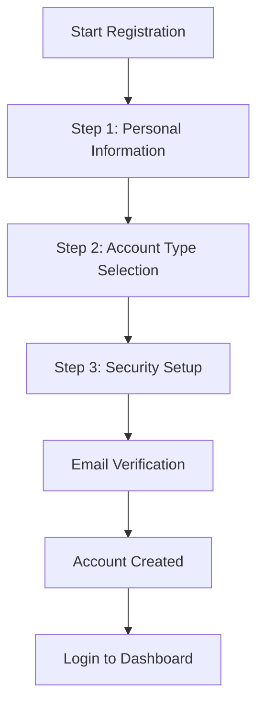

# User Registration Guide

This comprehensive guide walks you through the complete registration process for creating a new account in the SJRS Library Management System.

## Overview

The registration process is designed to be secure, user-friendly, and efficient. It consists of three main steps followed by email verification.

### Registration Flow



## Step-by-Step Registration Process

### 📍 Step 1: Personal Information

**Location**: `/register` (first step)

**Required Information**:
- **Email Address**: Valid email for account verification and communication
- **First Name**: Legal first name (automatically capitalized)
- **Last Name**: Legal last name (automatically capitalized)

#### Features
- **Real-time Email Validation**: Checks email availability as you type
- **Auto-capitalization**: Names automatically formatted properly
- **Duplicate Detection**: Prevents registration with existing email
- **Pending Registration Handling**: Shows hints for incomplete registrations

#### Validation Rules
```typescript
// Email validation
- Must be valid email format
- Cannot be already registered
- Rate limited for abuse prevention

// Name validation
- Required field
- Auto-capitalized on input
- Supports hyphens and apostrophes
```

#### User Experience
- **Responsive Design**: Optimized for mobile and desktop
- **Instant Feedback**: Real-time validation messages
- **Error Recovery**: Clear error messages with solutions
- **Progress Tracking**: Visual step indicator

### 🎯 Step 2: Account Type Selection

**Location**: `/register` (second step)

**Available Account Types**:

#### 👨‍🎓 Student Account
- **Purpose**: For students enrolled in academic programs
- **Features**: Book borrowing, reservations, digital resources access
- **Access**: Student dashboard and library services

#### 👨‍🏫 Professor Account  
- **Purpose**: For faculty members and instructors
- **Features**: Course management, research tools, extended borrowing
- **Access**: Faculty dashboard and administrative functions

#### 👤 Guest Account
- **Purpose**: For visitors and temporary users
- **Features**: Limited access, on-site resources
- **Access**: Guest dashboard with basic functionality

#### Selection Guidelines
- **Choose Accurately**: Account type affects permissions and features
- **Can Be Changed**: Contact administration to modify account type later
- **Role-Based Access**: Different dashboards and features per type

### 🔒 Step 3: Security Setup

**Location**: `/register` (third step)

**Security Features**:

#### Password Requirements
```
✅ Minimum 8 characters
✅ Maximum 128 characters  
✅ At least one uppercase letter (A-Z)
✅ At least one lowercase letter (a-z)
✅ At least one number (0-9)
✅ At least one special character (!@#$%^&* etc.)
❌ Cannot contain your name
❌ Cannot be common passwords
❌ Cannot use sequential patterns
```

#### Password Strength Indicators
- **Visual Feedback**: Real-time strength assessment
- **Requirement Checklist**: Shows which criteria are met
- **Security Tips**: Helpful guidance for strong passwords

#### Additional Security
- **Cloudflare Turnstile**: Bot protection and abuse prevention
- **Rate Limiting**: Prevents brute force attacks
- **Secure Transmission**: HTTPS encryption for all data

### 📧 Email Verification

**Location**: `/email-confirmation`

#### Verification Process
1. **Confirmation Email**: Sent immediately after registration
2. **Secure Link**: Unique, time-limited verification URL
3. **One-Click Verification**: Click link to confirm email
4. **Account Activation**: Account becomes fully functional

#### Email Features
- **Professional Design**: Clear, branded email template
- **Expiration**: Links expire after 24 hours for security
- **Resend Option**: Request new confirmation if needed
- **Status Tracking**: Real-time verification status

#### Troubleshooting
- **Email Not Received**: Check spam folder, resend confirmation
- **Link Expired**: Request new confirmation email
- **Wrong Email**: Contact support for email correction

## Special Registration Features

### 🔄 Smart Registration Recovery

#### Pending Registration Handling
- **Session Persistence**: Registration data saved in secure storage
- **Email Memory**: System remembers your email between sessions
- **Resume Capability**: Continue registration where you left off
- **Cross-Tab Sync**: Registration state synchronized across browser tabs

#### Error Recovery
- **Form Data Preservation**: Information saved during errors
- **Automatic Retry**: Smart retry mechanisms for temporary issues
- **Graceful Degradation**: Works even with some service disruptions

### 📱 Mobile Optimization

#### Responsive Design
- **Touch-Friendly**: Large tap targets for mobile devices
- **Adaptive Layout**: Optimized for all screen sizes
- **Mobile Navigation**: Swipe gestures and mobile-specific controls
- **Performance**: Fast loading on mobile networks

#### Mobile Features
- **Keyboard Optimization**: Proper keyboard types for each field
- **Auto-complete**: Mobile-friendly auto-complete suggestions
- **Zoom Support**: Proper zoom functionality without breaking layout

### 🛡️ Security Features

#### Advanced Protection
- **Bot Detection**: Cloudflare Turnstile integration
- **Rate Limiting**: Multiple rate limits for abuse prevention
- **Input Sanitization**: All inputs properly sanitized
- **Secure Storage**: Sensitive data stored securely

#### Privacy Protection
- **Data Minimization**: Only collect necessary information
- **Secure Transmission**: All data encrypted in transit
- **Privacy Compliance**: GDPR and data protection standards
- **User Control**: Control over your data and account

## After Registration

### 🎉 Successful Registration

#### What Happens Next
1. **Confirmation Email**: Check your inbox for verification
2. **Email Verification**: Click the confirmation link
3. **Account Activation**: Your account is now active
4. **Login**: Use your credentials to access the system
5. **Dashboard**: Explore your personalized dashboard

#### First Login
- **Welcome Tour**: Guided introduction to the system
- **Profile Setup**: Complete your profile information
- **Preferences**: Configure your account preferences
- **Explore**: Discover available features and resources

### 📧 Email Confirmation Process

#### Confirmation Email Contents
```
Subject: Confirm Your SJRS LMS Account

Dear [User Name],

Thank you for registering with SJRS Library Management System!

Please click the link below to confirm your email address and activate your account:

[Confirm Your Account]

This link will expire in 24 hours.

If you didn't create this account, please ignore this email.

Best regards,
SJRS LMS Team
```

#### Verification Status
- **Pending**: Email not yet confirmed
- **Confirmed**: Email verified, account active
- **Expired**: Link expired, need to resend
- **Error**: Technical issues with verification

### 🔧 Troubleshooting Common Issues

#### Registration Problems

**Email Already Registered**
```
Solution: 
1. Try to login with existing account
2. Use password reset if needed
3. Contact support if you believe this is an error
```

**Password Not Accepted**
```
Solution:
1. Check all password requirements
2. Use password strength indicator
3. Avoid common patterns and personal information
4. Include mix of character types
```

**Verification Email Not Received**
```
Solution:
1. Check spam/junk folder
2. Add noreply@sjrslms.com to contacts
3. Request resend of confirmation email
4. Verify email address is correct
```

**Confirmation Link Expired**
```
Solution:
1. Visit /resend-confirmation
2. Enter your email address
3. Request new confirmation email
4. Click new link within 24 hours
```

#### Technical Issues

**Page Not Loading**
```
Solution:
1. Check internet connection
2. Try different browser
3. Clear browser cache and cookies
4. Disable browser extensions
```

**Form Not Submitting**
```
Solution:
1. Check all required fields
2. Fix any validation errors
3. Ensure JavaScript is enabled
4. Try refreshing the page
```

## Account Types in Detail

### 👨‍🎓 Student Account Features

#### Library Services
- **Book Borrowing**: Up to 5 books simultaneously
- **Reservation System**: Queue for popular books
- **Digital Resources**: Access to e-books and journals
- **Study Rooms**: Book study spaces online

#### Academic Tools
- **Research Database**: Search academic papers
- **Citation Generator**: Create proper citations
- **Plagiarism Checker**: Verify originality
- **Course Materials**: Access course-specific resources

#### Dashboard Features
- **Reading Analytics**: Track reading habits
- **Loan History**: View borrowing history
- **Recommendations**: Personalized book suggestions
- **Academic Calendar**: View important dates

### 👨‍🏫 Professor Account Features

#### Advanced Library Access
- **Extended Borrowing**: Up to 15 books simultaneously
- **Research Support**: Priority access to research materials
- **Inter-library Loans**: Request books from other libraries
- **Digital Archives**: Access to special collections

#### Teaching Tools
- **Course Management**: Create and manage courses
- **Reading Lists**: Create required reading lists
- **Student Analytics**: Track student engagement
- **Assignment Tools**: Create and manage assignments

#### Administrative Features
- **Department Resources**: Access department-specific materials
- **Research Collaboration**: Connect with other researchers
- **Publication Support**: Tools for academic publishing
- **Grant Resources**: Access funding information

### 👤 Guest Account Features

#### Basic Access
- **On-site Resources**: Access library resources on premises
- **Catalog Browsing**: Search library catalog
- **Basic Information**: View library hours and policies
- **Event Information**: Access library events and workshops

#### Limited Services
- **Day Pass**: Temporary access to some digital resources
- **Reference Assistance**: Help from library staff
- **Public Computers**: Access to library computers
- **Printing Services**: Basic printing capabilities

## Security Best Practices

### 🔐 Password Security

#### Creating Strong Passwords
```
✅ Use passphrases: "CorrectHorseBatteryStaple"
✅ Mix character types: "MyL1brary@2024!"
✅ Avoid personal information: Don't use names, birthdays
✅ Unique passwords: Different password for each service
✅ Regular updates: Change passwords periodically
```

#### Password Management
- **Password Manager**: Use a reputable password manager
- **Two-Factor Authentication**: Enable when available
- **Security Questions**: Choose memorable, secure questions
- **Backup Methods**: Keep secure backup of passwords

### 🛡️ Account Security

#### Protection Measures
- **Secure Email**: Use a secure email account
- **Public Wi-Fi**: Avoid registration on public networks
- **Device Security**: Use secure, updated devices
- **Browser Security**: Keep browser updated and secure

#### Monitoring Your Account
- **Login Alerts**: Monitor for unusual login attempts
- **Account Activity**: Review your account activity regularly
- **Update Information**: Keep contact information current
- **Report Issues**: Report suspicious activity immediately

## Support and Help

### 📞 Getting Help

#### Registration Support
- **Email Support**: support@sjrslms.com
- **Phone Support**: +1-234-567-8900
- **Live Chat**: Available on website during business hours
- **Help Desk**: In-person support at library locations

#### Self-Service Resources
- **FAQ Section**: Common questions and answers
- **Video Tutorials**: Step-by-step video guides
- **Knowledge Base**: Comprehensive documentation
- **Community Forum**: User community support

### 📚 Additional Resources

#### User Guides
- **Getting Started Guide**: Introduction to the system
- **Dashboard Guide**: Using your personalized dashboard
- **Library Services Guide**: Using library features
- **Technical Requirements**: System requirements and compatibility

#### Training Materials
- **Video Tutorials**: Comprehensive video library
- **Interactive Tours**: Guided system tours
- **Printable Guides**: PDF documentation
- **Workshop Schedule**: In-person training sessions

## Frequently Asked Questions

### 🤔 Registration Questions

**Q: Can I change my account type after registration?**
A: Yes, contact the library administration to request an account type change.

**Q: What if I forget my password?**
A: Use the "Forgot Password" link on the login page to reset your password.

**Q: Can I register with a temporary email address?**
A: No, you must use a permanent, accessible email address for account verification.

**Q: Is my personal information secure?**
A: Yes, all data is encrypted and protected according to industry standards.

**Q: How long does email verification take?**
A: Usually immediate, but can take up to 10 minutes depending on your email provider.

**Q: Can I register multiple accounts?**
A: No, each person should have only one account. Multiple accounts may be suspended.

### 🔧 Technical Questions

**Q: What browsers are supported?**
A: Modern browsers including Chrome, Firefox, Safari, and Edge.

**Q: Do I need JavaScript enabled?**
A: Yes, JavaScript is required for the registration process.

**Q: Can I register on mobile devices?**
A: Yes, the registration process is fully optimized for mobile devices.

**Q: What if my confirmation link expires?**
A: Visit the resend confirmation page to request a new verification email.

---

**Last Updated**: v6.6.2 (2026-03-14)  
**Support**: support@sjrslms.com | **Help Desk**: +1-234-567-8900
